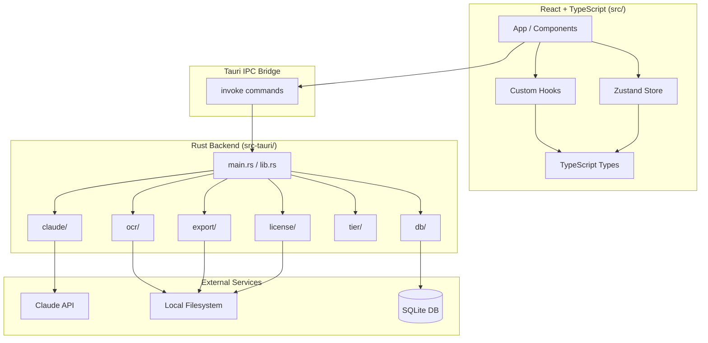

# DocuLift — Data Flow Diagram

**Last updated:** Step 0.5 (CI pipeline)

## Phase 0.5 status

GitHub Actions CI (`.github/workflows/ci.yml`) runs on every push and pull request to `main`: Rust fmt/clippy/tests, then frontend `npm ci`, Vite build, and `tsc --noEmit`. Cargo and npm caches are configured to speed up repeat runs.
